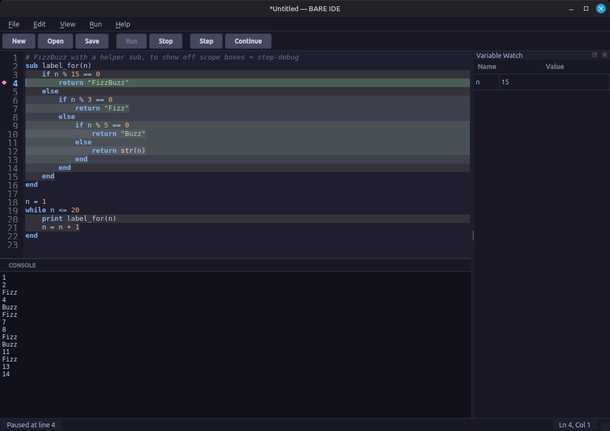

# BARE

**B**arely **A**dequate **R**untime **E**nvironment — a minimal procedural
teaching language with 11 reserved words, a single numeric type, one loop
construct, and one procedure construct.

BARE is part of the Fragillidae Programming Langauge Teaching Suite. It is
**IDE-first**: the editor, interpreter and console live in one PyQt6 process,
and that is where BARE is meant to be learned — with scope box colouring,
step debugging, breakpoints and the Variable Watch panel.

A standalone console runtime (`bare <file.bare>`) is also built from the same
`bare_core`, for editors that are not the BARE IDE. It runs a program and
reports errors; it has none of the teaching apparatus above. See
[Running outside the IDE](#running-outside-the-ide).



## Status

Feature-complete through Phase 6 of the implementation plan — core
interpreter, editor, syntax highlighting, threaded Run/Stop, step-debug
with breakpoints and Variable Watch, scope box coloring, and a Preferences
dialog — plus multi-file editor tabs and a file browser panel. See
[dev-docs/implementation-task-list.md](dev-docs/implementation-task-list.md)
for the full phase-by-phase history.

## Getting started

```bash
git clone https://github.com/CFFinch62/BARE.git
cd BARE
```

Then:

```bash
./setup.sh                    # creates venv, installs dev + ide extras
source venv/bin/activate
python -m pytest tests/ -v    # run the interpreter test suite
./run.sh                      # launch the IDE
```

To build a standalone executable (no Python install required to run it):

```bash
./build_release.sh            # installs PyInstaller extras, builds dist/bare-ide
```

## Running outside the IDE

`bare_core` has no PyQt6 dependency, so the language can run without the IDE.
`bare_cli.py` is the console entrypoint, and `build_cli.sh` packages it:

```bash
./build_cli.sh                # builds dist/bare
cp dist/bare ~/.local/bin/bare
bare myprogram.bare
```

The CLI takes a filename and nothing else. It prints the program's output on
stdout, reports errors as `Error on line N: message` on stderr, and exits 0 or
1 — enough for another editor to launch it and place the error. It has no
flags, and in particular **no parse-only mode**: the only way to find out
whether a program is valid is to run it.

This is what [MyCode](../../IDES) launches, and what the VS Code extension in
[editors/vscode](editors/vscode) drives.

## Editor support

[editors/vscode](editors/vscode) is a VS Code extension for `.bare` files:
syntax highlighting for all 11 reserved words, 3 literals and 7 builtins,
`end`-aware indentation, snippets for the idioms BARE's small vocabulary makes
you write by hand, and a Run command that drives the standalone runtime above.

It is not a replacement for the IDE — there are no scope boxes, no breakpoints
and no Variable Watch — and its README says so up front.

## Documentation

| Doc | Audience | Covers |
|---|---|---|
| [docs/language-spec.md](docs/language-spec.md) | Anyone writing BARE programs | The full language: syntax, types, control flow, subs, builtins, examples |
| [docs/user-guide.md](docs/user-guide.md) | Anyone using the IDE | Editor tabs, the file browser, running/debugging programs, breakpoints, Preferences, the personal library |
| [libraries/README.md](libraries/README.md) | Anyone writing BARE programs | String/math/trig/data/sort/list/format/validation/console-UI helpers, written entirely in BARE, ready to copy into your personal library |
| [curriculum/](curriculum/) | Teachers | A full K-12 learn-to-program curriculum built on BARE (see below) |
| [dev-docs/ARCHITECTURE.md](dev-docs/ARCHITECTURE.md) | Contributors | Component responsibilities, data flow, threading model |
| [dev-docs/TESTING_STRATEGY.md](dev-docs/TESTING_STRATEGY.md) | Contributors | Test pyramid, fixtures, how to run the suite |
| [dev-docs/BARE_language_spec.md](dev-docs/BARE_language_spec.md) | Contributors | The original design spec (grammar EBNF, rationale) this implementation was built from |
| [dev-docs/adding-a-builtin.md](dev-docs/adding-a-builtin.md) | Contributors | Step-by-step checklist for adding a new built-in function |

## Curriculum

[curriculum/](curriculum/) is a complete, three-tier learn-to-program
curriculum for classroom use, spanning roughly ages 8 to 18:

| Tier | Age / grade | Focus |
|---|---|---|
| [Tier 1 — BARE Beginnings](curriculum/tier1-beginnings/) | ~8-10 (grades 3-5) | Sequencing, variables, `print`/`input`, `if`/`else`, `while`, randomness |
| [Tier 2 — BARE Builders](curriculum/tier2-builders/) | ~11-13 (grades 6-8) | `sub`s and scope, lists, the full builtin set, debugging tools, the personal library |
| [Tier 3 — BARE Projects](curriculum/tier3-projects/) | ~14-18 (grades 9-12) | Algorithmic thinking, recursion, program design, refactoring, a capstone, and a bridge to other languages |

Each tier is a semester's worth of lesson plans, student worksheets, and
checkpoint quizzes/rubrics. Start with
[curriculum/teachers-guide.md](curriculum/teachers-guide.md) — it covers
classroom setup, BARE-specific student misconceptions worth knowing in
advance, and grading philosophy.

## Language quick reference

**11 keywords:** `print` `input` `if` `else` `end` `while` `sub` `return` `and` `or` `not`

**8 builtins:** `len(x)` `append(list, value)` `input(prompt)` `str(x)` `num(x)` `random(min, max)` `round(x, decimals)` `time()`

```
sub factorial(n)
    if n <= 1
        return 1
    else
        return n * factorial(n - 1)
    end
end

print factorial(5)
```

See [docs/language-spec.md](docs/language-spec.md) for the complete reference, or
[examples/](examples/) for runnable sample programs. [libraries/](libraries/)
goes a step further: string, math, trigonometry, dictionary/set, sorting,
list, formatting, validation, and console-UI helpers — built entirely out
of BARE's 11 keywords and 8 builtins, proof that a small language can
still get you a long way.

## Project layout

```
src/bare_core/   Lexer, parser, tree-walking interpreter — no GUI dependency
src/bare_ide/    PyQt6 IDE: editor, console, debugger, themes, settings
tests/           Unit + integration tests for bare_core (234 tests)
examples/        Sample .bare programs (FizzBuzz, factorial, lists, ...)
libraries/       String/math/trig/data/sort/list/format/validation/TUI helpers, written in BARE
docs/            User-facing language spec and IDE user guide
curriculum/      K-12 learn-to-program curriculum: lesson plans, worksheets, assessments
dev-docs/        Design docs, implementation plan, architecture notes
installer/       PyInstaller spec (build_release.sh drives this)
```
