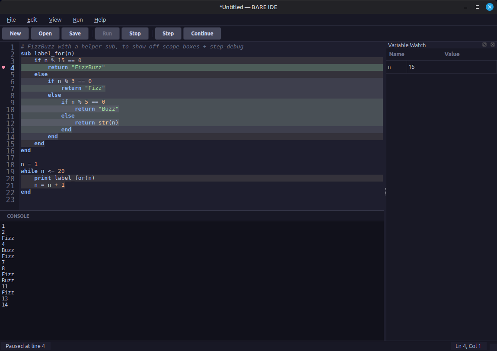

# BARE IDE — User Guide

This guide covers using the **BARE IDE** itself: writing, running, and
debugging programs. For the language BARE programs are written in — every
keyword, every builtin, every example — see
[language-spec.md](language-spec.md). This guide assumes you already know
what a `sub` or a `while` loop is; it's about the editor around them.



---

## 1. Launching the IDE

**From a standalone build** (no Python installation required): run the
`bare-ide` executable produced by `build_release.sh` (see the main
[README](../README.md)).

**From source**, during development:

```bash
./setup.sh              # one-time: creates a venv, installs dependencies
./run.sh                 # launches the IDE
```

BARE is **IDE-locked** — there's no separate command-line way to run a
`.bare` file. The editor, the interpreter, and the console all live in this
one window.

---

## 2. The window, top to bottom

- **Menu bar**: File, Edit, View, Run, Help.
- **Toolbar**: New, Open, Save, then Run, Stop, Step, Continue.
- **Editor** (top pane): where you write code. Line numbers on the left
  double as a breakpoint gutter — see §6.
- **Console** (bottom pane, labeled CONSOLE): `print` output appears here,
  errors appear here in red, and when a program calls `input()`, a text
  field appears right in this pane for you to type into.
- **Variable Watch** (right dock, hidden until you need it): a table of
  variable names and values, populated automatically the first time you
  hit a breakpoint or step through a program. Toggle it anytime from
  **View → Variable Watch**.
- **User Guide** / **Language Spec** (right dock, tabbed with Variable
  Watch): this guide and the full language reference, rendered inside the
  IDE so you can read either side by side with your code instead of
  switching to a browser. Toggle them from **View → User Guide** / **View →
  Language Spec** — links between the two documents resolve in place rather
  than swapping tabs blindly.
- **My Library** (right dock, same tab group): your personal, growing set
  of reusable `sub`s — see §9.
- **Status bar**: run state on the left (`Ready`, `Running...`,
  `Paused at line N`, `Stopped`, `Error on line N`), cursor position
  (`Ln, Col`) on the right.

---

## 3. Your first run

1. **File → New** (or just start typing in a blank window).
2. Type:
   ```
   print "Hello, world!"
   ```
3. Click **Run** (or press **F5**).

Output appears in the console below, and the status bar briefly shows
`Running...` before settling on `Ready`.

---

## 4. Reading the code you've written

As you type, the editor colors your code by category — this happens live,
with no need to run anything:

| Color role | Applies to |
|---|---|
| Keyword (bold) | `print` `input` `if` `else` `end` `while` `sub` `return` `and` `or` `not` |
| Builtin | `len` `append` `str` `num` `random` `round` |
| String | Anything in `"double quotes"` |
| Number | `5`, `3.14`, etc. |
| Literal | `true` `false` `null` — colored distinctly from keywords, since they're values, not control flow |
| Comment | Anything after `#`, shown in italic |

The exact colors depend on your active theme (see §10), but the categories
are the same across all of them.

### Scope boxes

Nested `if`/`while`/`sub` bodies get a subtle background tint, one shade
per nesting depth, so you can see at a glance which `end` closes which
block without counting indentation by eye. This updates live as you type
and doesn't require your code to be syntactically complete — a dangling
`if` with no matching `end` yet just doesn't get a box for *that* block,
without breaking the boxes around it. You can turn this off in
**Preferences** if you'd rather not have it (§10).

---

## 5. When something goes wrong

BARE has no exception handling (see [language-spec.md §9](language-spec.md#9-errors))
— an error stops the program and the IDE shows you exactly where and why,
in two places at once:

- **In the editor**: a **red squiggly underline** means a problem was
  found before your program even started running (a syntax mistake — a
  missing `end`, an unbalanced `(`, etc.). A **yellow highlighted line**
  means the program started running and hit a problem partway through —
  that's the exact line execution was on when it stopped.
- **In the console**: the same single-line diagnostic from the language
  spec, e.g. `Error on line 7: cannot add string and boolean`.

The highlight clears automatically the moment you start editing — you
don't need to dismiss anything.

---

## 6. Stopping a runaway program

If you write `while true` and forget to make the condition ever become
false, the program would loop forever. Click **Stop** (or **Shift+F5**) —
the IDE stays fully responsive the entire time a program is running
(including one stuck in an infinite loop), because your code actually
executes on a background thread, not the same thread drawing the window.
The status bar shows `Stopped` once it's cancelled.

---

## 7. Debugging: breakpoints, Step, and Continue

This is the most useful feature for actually understanding what your code
is doing, one line at a time.

**Breakpoints**: click in the line-number margin next to any line to toggle
a red dot. Click **Run** — execution proceeds at full speed and *pauses*
right before that line runs.

**Step** (**F10**): if nothing is running yet, Step starts the program and
pauses immediately, before the very first line. If a program is already
paused, Step advances exactly one statement and pauses again — this is how
you walk through code line by line regardless of breakpoints.

**Continue** (**F6**): only available while paused. Resumes at full speed
until the next breakpoint (or the program ends).

**While paused**, the current line is highlighted in green (a different
color from the yellow runtime-error highlight, so you never confuse "this
is where we stopped to look" with "this is where something broke"), and
the **Variable Watch** panel shows every variable in the *current* scope —
if execution is paused inside a `sub`, you'll see that sub's parameters and
locals, not the program's global variables. That's not a limitation of the
debugger; it's the same rule from [language-spec.md §7](language-spec.md#7-subs)
made visible: a sub genuinely cannot see globals, so there's nothing else
to show.

---

## 8. Files

- **New** (Ctrl+N) / **Open...** (Ctrl+O) / **Save** (Ctrl+S) /
  **Save As...** (Ctrl+Shift+S) — standard behavior, filtered to `.bare`
  files by default.
- If you try to close a file, open a different one, or quit with unsaved
  changes, the IDE asks whether to save first — you won't lose work
  silently.
- The window title shows the current filename with a leading `*` while
  there are unsaved changes.

---

## 9. Building your own library

Every `sub` you write normally lives only in the file it's in — start a new
program and it's gone. The **My Library** panel (right dock, tabbed with
User Guide/Language Spec/Variable Watch — toggle from **View → My
Library**) gives you a personal, growing set of subs that follow you into
every future program, written entirely in BARE.

**Saving a sub**: select a complete `sub ... end` block in the editor (from
the `sub` line to its matching `end`), then **Edit → Save Selection to
Library**. If the name is new, it's added; if you've already saved a sub
with that name, you're asked whether to overwrite it — editing and
re-saving a function updates every future program that calls it, since the
body only lives in one place, not copy-pasted into each program that uses
it.

**Using a saved function**: just call it by name, e.g. `double(21)`, in any
program — no import statement, no new syntax. Every time you click **Run**,
the IDE silently loads your library first, then reports what it found in
the console, e.g. `Loaded from your library: double, greet`, so it's never
a mystery where an unfamiliar function came from. The **My Library** panel
lists every saved function's name and parameters; double-click an entry to
insert a ready-to-fill-in call at your cursor.

**Editing or refactoring your whole library**: saving one sub at a time is
fine for adding new functions, but sooner or later you'll want to rename
something, delete an old one, or just clean the file up — for that, use
**File → Open My Library** (or the **Edit Library File...** button at the
bottom of the My Library panel). This opens `user_library.bare` directly in
the main editor, exactly like any other file: full syntax highlighting,
free-form editing, and a normal **Ctrl+S** writes straight back to it. You
can even click **Run** while it's open, purely as a quick check that it
still parses cleanly — since a library with nothing but `sub` definitions
has no output of its own, that's all a run of it will ever do.

**Name collisions**: if your open program happens to define its own `sub`
with the same name as something in your library, your program's version
wins for that run — the same rule as redefining any sub twice in one file.

**If your library itself has a mistake** (a stray `end`, a typo), Run shows
`In your library — Error on line N: ...` in the console instead of running
your program. Open it via **File → Open My Library** to fix the block named
there.

---

## 10. Preferences and themes

**Edit → Preferences...** (Ctrl+,) opens a dialog with:

- **Theme** — see the six options below.
- **Editor font** and **font size**.
- **Tab width**.
- **Word wrap** toggle.
- **Scope boxes** toggle (§4).

Click **Apply** to preview changes without closing the dialog, or **OK** to
apply and close. Preferences persist between sessions.

You can also switch themes quickly from **View → Theme** without opening
the full dialog. Six are built in: **Dark**, **Light**, **Grey**,
**Solarized Light**, **Solarized Dark**, and **High Contrast** — pick
whichever is easiest on your eyes; syntax highlighting and every
debug/error color adapts automatically.

---

## 11. Keyboard shortcuts

| Action | Shortcut |
|---|---|
| New file | Ctrl+N |
| Open file | Ctrl+O |
| Save | Ctrl+S |
| Save As | Ctrl+Shift+S |
| Quit | Ctrl+Q |
| Undo / Redo | Ctrl+Z / your platform's Redo key |
| Cut / Copy / Paste | Ctrl+X / Ctrl+C / Ctrl+V |
| Preferences | Ctrl+, |
| Clear Console | Ctrl+L |
| **Run** | **F5** |
| **Stop** | **Shift+F5** |
| **Step** | **F10** |
| **Continue** | **F6** |

---

## 12. Try it: run an example

**File → Open...**, navigate to the `examples/` folder in the project, and
open `guessing_game.bare`. Click **Run**, and when the console prompts
`Your guess:`, type a number into the field that appears right there in
the console and press Enter. Try setting a breakpoint on the `guess =
num(response)` line first and watch the Variable Watch panel to see
`secret`, `guess`, and `attempts` update each time through the loop.

---

## 13. Troubleshooting

- **Nothing happens when I click Run.** Check the console for a red error
  line — a syntax error stops the program before it starts, and the
  squiggle in the editor shows you where.
- **The program seems stuck.** If you have a `while` loop, check that its
  condition can actually become false. Click **Stop** — it works even on a
  genuine infinite loop, since it doesn't depend on your program
  cooperating.
- **Variable Watch is empty.** It only populates while a program is
  *paused* (a breakpoint hit, or Step mode) — it's not a live view during a
  full-speed Run, and it clears once the program finishes or stops.
- **I don't see the color I expect.** Colors come from your active theme
  (§10) — try switching themes if a particular category is hard to
  distinguish, rather than assuming something's broken.
- **My program calls a function I never defined, and it works.** It's
  probably in your personal library (§9) — check the **My Library** panel,
  or look for a `Loaded from your library: ...` line in the console.

---

Next: [language-spec.md](language-spec.md) for everything about the
language itself.
